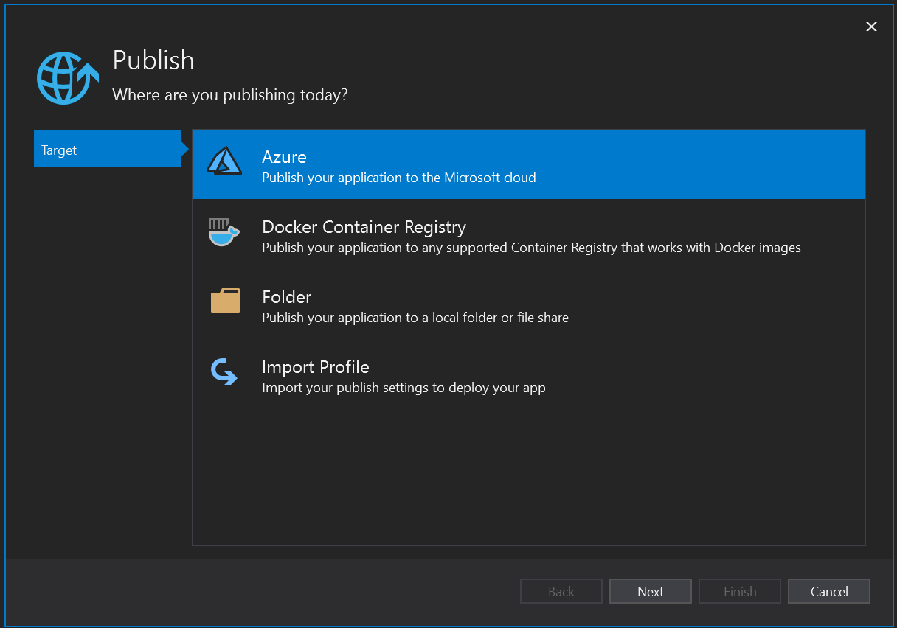

# Getting Started with Real-Time KQL

### Prerequisites

* Real-Time KQL has to be built in a Windows machine, but can be published to either a Windows or Linux machine. (See below for instructions on publishing to a Linux machine).

- [.NET SDK 3.1.200](https://dotnet.microsoft.com/download/dotnet-core/3.1#sdk-3.1.200)
  - Download and install the specific version (3.1.200).
- [.NET Framework 4.6.2 Developer Pack](https://dotnet.microsoft.com/download/dotnet-framework/net462)
  - Download and install the specific version (4.6.2). Make sure to install the Developer Pack (and not the Runtime).
- [Visual Studio 2019](https://visualstudio.microsoft.com/downloads/)
  - Only required if you want to run Real-Time KQL on a Linux machine.

### Download and Setup for Windows

1. [Download](https://github.com/microsoft/KqlTools/archive/master.zip) the Real-Time KQL Project and extract all the files.
2. Open a Command Prompt as Administrator and navigate to the folder where you saved the project.
3. Navigate to the "Source" folder.

### Build for Windows
1. Within the source folder, run `dotnet build KqlTools.sln -r win-x64 `
2. Right above the "Build succeeded." message, there will be a series of paths printed to console. Find the path following "RealTimeKql ->".
3. Copy everything in the path except for the .exe file at the end. Your path will look something like "...\Source\RealTimeKql\bin\Debug\net462\win-x64\".
4. Navigate to the folder with the .exe file by using the path you just copied.
5. You can now run the program from this folder.

### Run on Windows

1. Make sure you're in the folder housing the .exe file (see previous section for instructions on getting here).
2. Run `RealTimeKql --help` to get an overview of your options.
3. For more information and examples on using Real-Time KQL for Windows:
   - [winlog](winlog.md): OS or application log you see in EventVwr
   - [evtx](evtx.md): log file(s) on disk. Example is file(s) copied from another machine
   - [etwSession](etwSession.md): real-time session in Event Tracing for Windows (ETW)
   - [etl](etl.md): previously recorded "Event Trace Log" by using ETW

### Download and Setup for Linux

1. [Download](https://github.com/microsoft/KqlTools/archive/master.zip) the Real-Time KQL Project and extract all the files.
2. Navigate to the "Source" folder.
3. Open "KqlTools.sln" in Visual Studio 2019.

### Publish for Linux

1. Right-click the "RealTimeKql" project in the Solution Explorer and select "Publish".

2. If you don't get the following pop-up window right away, you may have to repeat Step 1:
   

3. In the Publish pop-up window above, click "Folder" and then "Next". Then select "Finish".

4. Now select the edit icon next to "Target runtime". 

5. Match your Profile settings to these:
   

   If you can't see "Deployment mode" right away, you can hit "Save" and then the edit icon next to "Target runtime" again. You should now be able to change your "Deployment mode" if needed.

6. Save to exit the Profile settings window. Your Publish Summary should look like this now:
   

4. Hit "Publish".
5. In the output window, note the last path printed beginning with "RealTimeKql ->" and ending with "\bin\Release\netcoreapp3.2\publish"

### Run on Linux

*TODO*